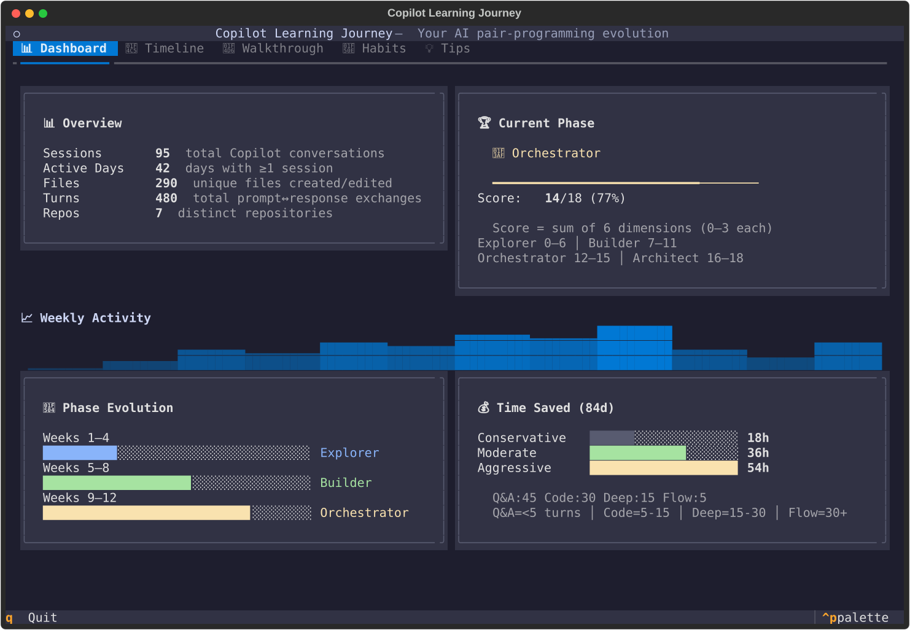
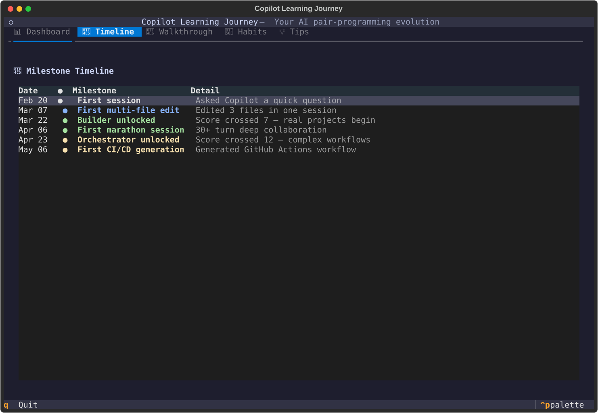
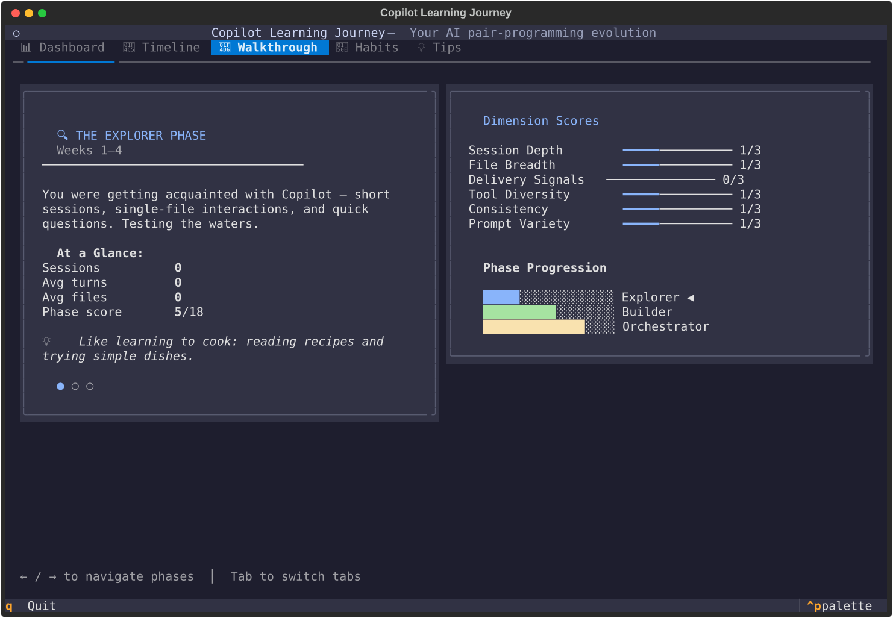
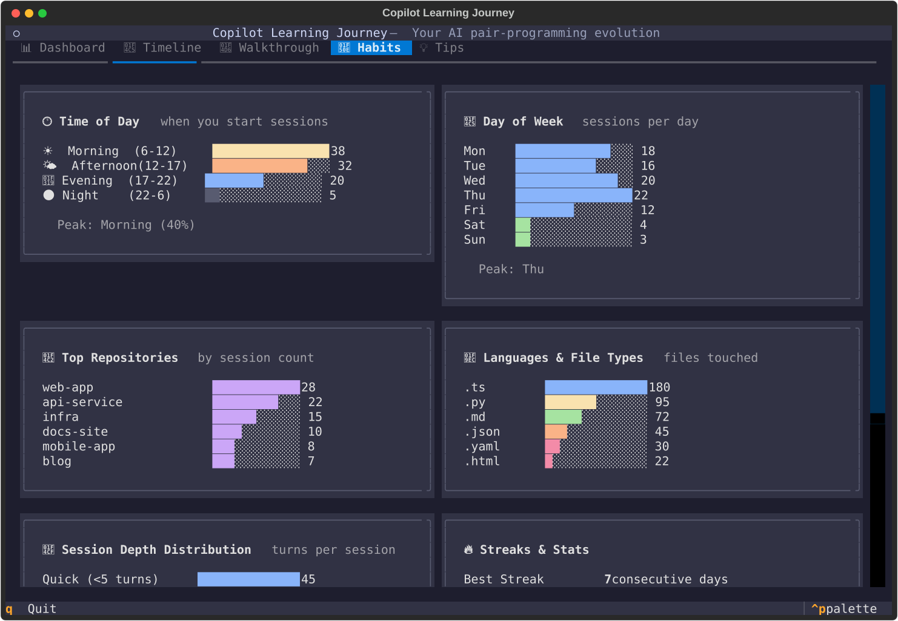
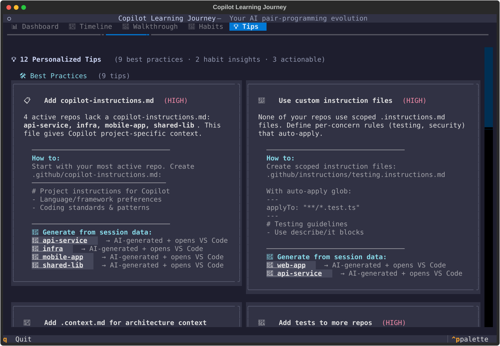

# 🚀 Copilot Journey TUI

A terminal dashboard that visualizes your GitHub Copilot CLI learning journey — phases, habits, and personalized tips to grow your skills.

Built with [Textual](https://github.com/Textualize/textual) and the Catppuccin Mocha theme.

 

<p align="center">
  
</p>

## Quick Start

```bash
pip install git+https://github.com/timschps/copilot-journey-tui
copilot-journey-tui
```

> Requires Python 3.10+ and an existing [GitHub Copilot CLI](https://docs.github.com/en/copilot/github-copilot-in-the-cli) session history. 100% offline — nothing leaves your machine.

### Optional: VS Code CLI

Many tips include **clickable action buttons** that auto-create config files and open them in VS Code. To enable this, install the `code` CLI:

> **VS Code** → `Ctrl+Shift+P` → *"Shell Command: Install 'code' command in PATH"*

The TUI will detect whether `code` is available and show a tip if it's missing.

<details>
<summary>Alternative install methods</summary>

```bash
# Clone and install locally
git clone https://github.com/timschps/copilot-journey-tui && cd copilot-journey-tui
pip install .

# Or run without installing
pip install textual
python -m copilot_journey_tui

# Custom database path
copilot-journey-tui --db /path/to/session-store.db
```

</details>

## What It Does

Reads your **local** Copilot CLI session history (100% offline — nothing leaves your machine) and turns it into an interactive 5-tab dashboard:

### 📊 Dashboard
Two-column overview with contextual legends:
- **Phase Evolution** — your progress through Explorer → Builder → Orchestrator → Architect, shown as a scored bar chart across time windows
- **ROI Estimate** — conservative, moderate, and aggressive time-saved calculations based on session depth, file edits, and tool usage
- Weekly activity sparkline, total sessions, active days, repos, and files touched
- Inline legend explains phase scoring scale and ROI calculation methodology

### 📅 Timeline
Interactive milestone table tracking key moments in your journey — first multi-file build, first marathon session, phase transitions, and more. Color-coded by phase.



### 📖 Walkthrough
Step through each phase of your evolution with `←` / `→` keys:
- **Left panel**: narrative description of what you were doing in that period
- **Right panel**: 6-dimension radar breakdown (Session Depth, File Breadth, Delivery Signals, Tool Diversity, Consistency, Prompt Variety) with a phase progression chart



### 🔎 Habits
Deep dive into your usage patterns with contextual legends explaining each metric:
- **Time patterns** — peak hour, day-of-week distribution, morning/afternoon/evening/night breakdown
- **Session depth** — distribution of quick Q&As vs. deep builds vs. marathon sessions
- **Streaks** — longest and current consecutive-day streaks
- **Top repos** — most-used repositories with session counts
- **Languages** — file extension breakdown across all sessions
- **Prompt quality** — average message length and median turns per session
- **Recent topics** — latest checkpoint titles showing what you've been working on

Each stat card includes an inline legend explaining what the numbers mean and how to interpret them.



### 💡 Tips
Personalized, actionable recommendations grouped by category:

- **🛠️ Best Practices** — based on per-repo adoption scans:
  - Detects which repos have `copilot-instructions.md`, custom `.instructions.md` files, `SKILL.md`, `mcp.json`, `.context.md`, tests, docs, and CI/CD configs
  - Tips name **specific repos** where you can take action (e.g., *"Add copilot-instructions.md to web-app, api-service"*)
  - Each tip includes a **How-to** section with file templates, prompt examples, and candidate repos
- **📊 Usage Habits** — streak building, session depth, prompt quality, delivery signals
- **🎯 Phase Progression** — what to focus on to reach the next level
- **💻 Environment** — checks for VS Code CLI and other tooling

Tips that you've already adopted show as ✅ confirmations.

#### 📊 Impact Indicators

Every per-repo action button shows an **impact badge** to help you prioritize:

| Badge | Meaning |
|-------|---------|
| 🔴 High | High-activity repo with missing or low-quality config — biggest bang for your buck |
| 🟡 Medium | Moderate activity or some config gaps — worthwhile improvement |
| 🟢 Low | Less active repo or minor gaps — improve when you have time |

Impact is calculated from: session frequency, file count (how much code Copilot needs to understand), and current quality gaps.

#### 🔍 Quality Checking

For repos that **already have** config files (`copilot-instructions.md`, `.context.md`), the tool assesses their quality:

- **Content depth** — line count, non-empty lines
- **Section coverage** — checks for key sections (Language/Framework, Coding Standards, Error Handling, Testing, Architecture, Dependencies)
- **Placeholder detection** — flags unfilled template text
- **Structure** — headings, lists, organization

Low-quality files get a score (e.g., `45%`) and a **📝 Improve** button that regenerates the file from session data while preserving the existing file as a reference.

#### 🤖 Smart Generation (AI-powered)

Tip buttons marked with 🤖 use **session-log intelligence** — when clicked, they:

1. **Mine your session history** for the target repo (file structure, summaries, checkpoints, branches, user prompts)
2. **Generate a pre-populated file** with real project insights (not a generic template)
3. **Create a companion `.copilot-enhance-*.md`** with a ready-to-paste Copilot Chat prompt

The companion file includes a **copy-paste prompt** for Copilot Chat:
```
@workspace Using the session data in .copilot-enhance-context.md, rewrite the
context file to be comprehensive and project-specific. Remove all placeholder text.
```

This works for `copilot-instructions.md`, `.context.md`, and `testing.instructions.md`.

#### Per-repo action buttons

Each tip shows clickable buttons **per repository** — so you choose exactly which repos to set up. Clicking a button:
1. Creates the file (skips if it already exists)
2. Opens VS Code at the repo root with the new file ready for editing



## Navigation

| Key         | Action                     |
|-------------|----------------------------|
| `1`–`5`     | Jump to tab                |
| `Tab`       | Next tab                   |
| `↑` / `↓`  | Navigate timeline rows     |
| `←` / `→`  | Step through walkthrough   |
| `q`         | Quit                       |

## How It Works

1. **Auto-detects** your Copilot CLI session store (`~/.copilot/session-store.db` or platform equivalent)
2. **Loads** all sessions, turns, file edits, checkpoints, and refs
3. **Splits** your history into time windows and scores each on 6 dimensions
4. **Classifies** phases: Explorer → Builder → Orchestrator → Architect
5. **Detects** milestones (first multi-file build, marathon sessions, phase transitions)
6. **Profiles** each repo for best-practice adoption (instruction files, tests, docs, CI/CD)
7. **Generates** personalized tips pointing to specific repos where you can take action
8. **Estimates** ROI with conservative/moderate/aggressive ranges
9. **Smart generation** — action buttons mine session logs at click time to create project-aware config files
10. **Copilot Chat bridge** — companion prompt files contain session data for AI-powered refinement

## Phase Classification

| Phase | Score | Description |
|-------|-------|-------------|
| 🔍 Explorer | 0–6 | Getting acquainted — short sessions, quick questions |
| 🔨 Builder | 7–11 | Real work — multi-file projects, growing confidence |
| 🎯 Orchestrator | 12–15 | Complex workflows — delegation, cross-file changes |
| 🏛️ Architect | 16–18 | System-level — strategic automation, full mastery |

## Scoring Dimensions

Each time window is scored 0–3 on six dimensions:

| Dimension | What it measures |
|-----------|-----------------|
| Session Depth | Turns per session (quick Q&A → deep collaboration) |
| File Breadth | Files touched per session (single file → cross-project) |
| Delivery Signals | Links to PRs, commits, branches |
| Tool Diversity | Range of tools used (edit, create, grep, bash, etc.) |
| Consistency | Frequency of use (sporadic → daily habit) |
| Prompt Variety | Message length and complexity |

## Per-Repo Best-Practice Detection

The Tips tab scans your session history for adoption signals in each repository:

| Signal | What it looks for |
|--------|-------------------|
| `copilot-instructions.md` | `.github/copilot-instructions.md` |
| Custom instructions | `*.instructions.md` files (scoped rules) |
| Skills | `SKILL.md` files |
| MCP config | `mcp.json` configuration |
| Context files | `.context.md` architecture docs |
| Tests | Files matching `*test*` or `*spec*` |
| Documentation | `README*` or `docs/` directory |
| CI/CD | `.github/workflows/`, `Dockerfile`, `azure-pipelines` |

## Privacy

Everything runs locally. The TUI reads the SQLite database that the Copilot CLI already stores on your machine. No data is sent anywhere.
